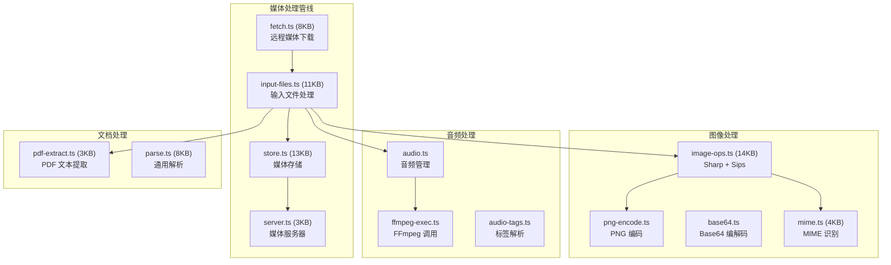

# 模块分析：多媒体特性 (Media & Features)

## 媒体处理 — `src/media/` (41 文件)

### 图像处理 (`image-ops.ts` 14KB)

- **Sharp**：Node.js 高性能图像处理（缩放、格式转换、EXIF 清理）
- **macOS Sips**：平台原生后备方案
- 自动分辨率优化（适配 LLM 图像输入限制）
- 安全路径策略（`inbound-path-policy.ts`）

### 媒体存储与服务

- `store.ts`（13KB）：临时文件管理、生命周期控制、自动清理
- `server.ts`（3KB）：本地 HTTP 媒体服务，供 Agent 和渠道引用

---

## 图像生成 — `src/image-generation/`

多模型图像生成抽象层，支持 DALL-E、Stable Diffusion 等。

---

## 浏览器自动化 — `src/browser/`

Agent 可控制的无头浏览器能力，支持页面导航、截图、内容提取。
