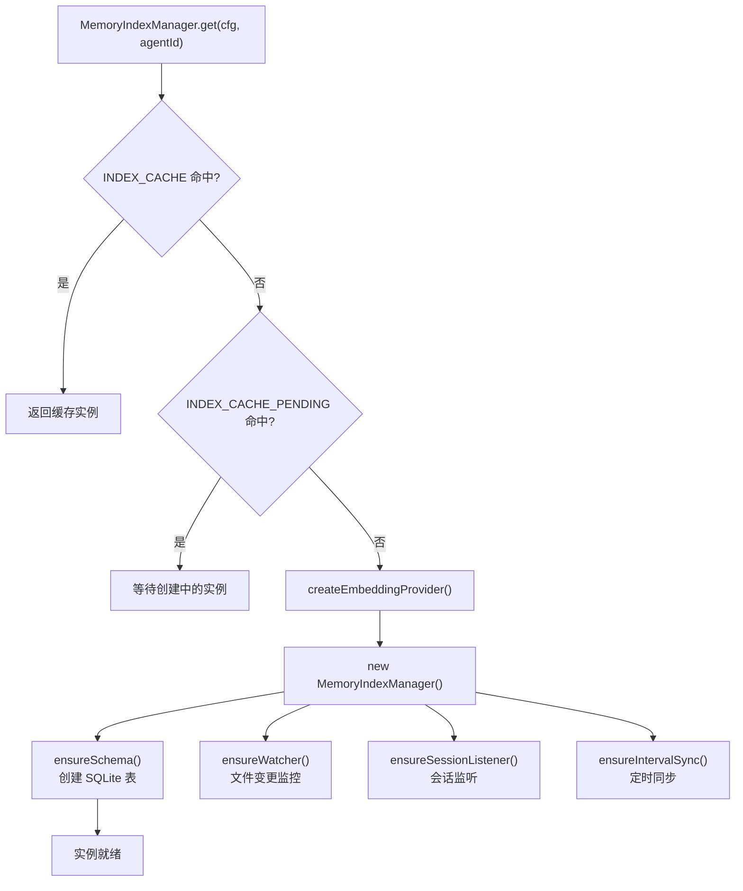
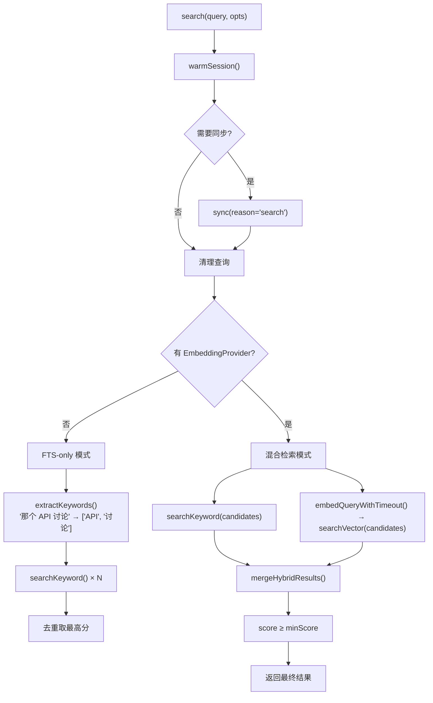
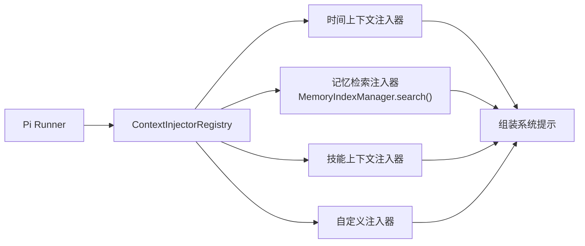

# 模块深度分析：记忆与上下文引擎

> 基于 `src/memory/manager.ts`（859 行）源码逐行分析，覆盖混合检索、嵌入管理、同步机制。

## 1. MemoryIndexManager 架构

`MemoryIndexManager` 是记忆系统的核心类，继承自 `MemoryManagerEmbeddingOps`，实现 `MemorySearchManager` 接口。



### 1.1 单例缓存策略

```typescript
// L153-L208 — 基于组合键的全局单例
static async get(params): Promise<MemoryIndexManager | null> {
  const key = `${agentId}:${workspaceDir}:${JSON.stringify(settings)}`;
  // 三层查找：缓存 → 正在创建 → 新建
  const existing = INDEX_CACHE.get(key);
  if (existing) return existing;
  const pending = INDEX_CACHE_PENDING.get(key);
  if (pending) return pending;
  // 创建新实例并缓存
}
```

**缓存键组成**：`agentId` + `workspaceDir` + `序列化的 settings`，确保不同配置的同一 Agent 获得独立实例。

---

## 2. 混合检索引擎

### 2.1 搜索流程（`search()` L277-L385）



### 2.2 FTS-Only 模式（无嵌入 Provider 时）

```typescript
// L304-L337 — 当没有嵌入供应商时，使用纯全文检索
const keywords = extractKeywords(cleaned);
// 对每个关键词独立搜索，合并去重
const resultSets = await Promise.all(
  searchTerms.map(term => this.searchKeyword(term, candidates))
);
// 跨结果集去重，保留每个 chunk 的最高分
const seenIds = new Map();
for (const result of results) {
  const existing = seenIds.get(result.id);
  if (!existing || result.score > existing.score) seenIds.set(result.id, result);
}
```

### 2.3 混合结果合并（`mergeHybridResults`）

权重配置：
- `vectorWeight`：向量搜索权重（默认较高）
- `textWeight`：全文搜索权重（默认较低，如 0.3）
- `mmr`：最大边际相关性去重（`lambda` 参数控制多样性）
- `temporalDecay`：时间衰减（`halfLifeDays` 控制半衰期）

**宽松阈值回退**（L368-L384）：
```typescript
// 当 minScore(0.35) > textWeight(0.3) 导致关键词精确匹配被过滤时
// 自动降低阈值到 textWeight，保留仅有的关键词匹配结果
const relaxedMinScore = Math.min(minScore, hybrid.textWeight);
```

---

## 3. 嵌入 Provider 系统

支持 6 种嵌入供应商（L86-L93）：

| Provider | 接口类型 | 说明 |
|----------|---------|------|
| `openai` | `OpenAiEmbeddingClient` | OpenAI text-embedding 系列 |
| `gemini` | `GeminiEmbeddingClient` | Google Gemini embedding |
| `voyage` | `VoyageEmbeddingClient` | Voyage AI |
| `mistral` | `MistralEmbeddingClient` | Mistral embed |
| `ollama` | `OllamaEmbeddingClient` | 本地 Ollama |
| `local` | 内置 | 本地计算 |

**Provider 回退**：`fallbackFrom` 和 `fallbackReason` 记录自动回退信息。

---

## 4. SQLite 存储层

### 数据库表结构

| 表名 | 用途 |
|------|------|
| `files` | 已索引文件元数据（路径、大小、修改时间、source 类型） |
| `chunks` | 文件分块（文本片段、行号范围、source） |
| `chunks_vec` | 向量索引（sqlite-vec 扩展） |
| `chunks_fts` | FTS5 全文索引 |
| `embedding_cache` | 嵌入缓存（避免重复计算） |
| `meta` | 元数据（vectorDims、provider key） |

### Readonly 恢复机制

```typescript
// L572-L607 — SQLite 只读错误自动恢复
private async runSyncWithReadonlyRecovery(params) {
  try { await this.runSync(params); }
  catch (err) {
    if (!this.isReadonlyDbError(err)) throw err;
    // 关闭旧连接，重新打开数据库
    this.db.close();
    this.db = this.openDatabase();
    this.vectorReady = null;
    this.ensureSchema();
    await this.runSync(params);  // 重试
    this.readonlyRecoverySuccesses += 1;
  }
}
```

---

## 5. 数据同步系统

### 5.1 同步触发方式

- **文件变更**：`chokidar` 监控工作区文件变动
- **会话更新**：`ensureSessionListener()` 监听会话记录变化
- **定时同步**：`ensureIntervalSync()` 周期性全量同步
- **搜索时同步**：`search()` 调用时检查 dirty 标志
- **会话启动**：`warmSession()` 触发预热同步

### 5.2 排队会话同步

```typescript
// L493-L521 — 防止同步风暴
private enqueueTargetedSessionSync(sessionFiles) {
  for (const file of sessionFiles) this.queuedSessionFiles.add(file);
  if (!this.queuedSessionSync) {
    this.queuedSessionSync = (async () => {
      await this.syncing?.catch(() => undefined);  // 等待当前同步完成
      while (!this.closed && this.queuedSessionFiles.size > 0) {
        const queued = Array.from(this.queuedSessionFiles);
        this.queuedSessionFiles.clear();
        await this.sync({ reason: "queued-session-files", sessionFiles: queued });
      }
    })();
  }
}
```

---

## 6. 记忆源（Memory Sources）

| Source | 含义 |
|--------|------|
| `memory` | 工作区 MEMORY.md 文件 |
| `session` | 历史会话记录 |
| `extra` | 额外配置的路径 |

### 文件读取安全（`readFile` L609-L680）

```typescript
// 安全约束：
// 1. 仅允许读取 .md 文件
// 2. 工作区内部且匹配 isMemoryPath() 的路径
// 3. 或者在 settings.extraPaths 配置的额外路径中
// 4. 额外路径中拒绝符号链接（stat.isSymbolicLink() → skip）
```

---

## 7. 上下文引擎（`src/context-engine/`）

`ContextInjectorRegistry` 管理动态上下文注入器：



每个注入器实现 `ContextInjector` 接口，按优先级执行并将结果拼接到系统提示中。
