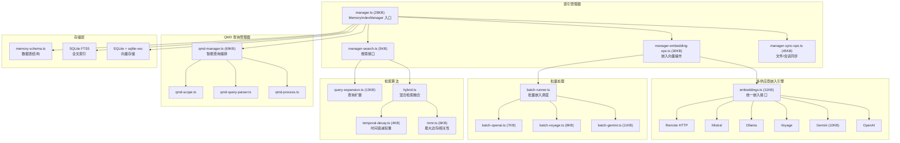
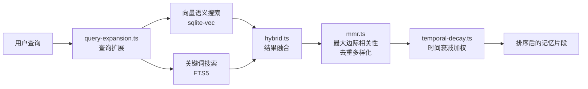
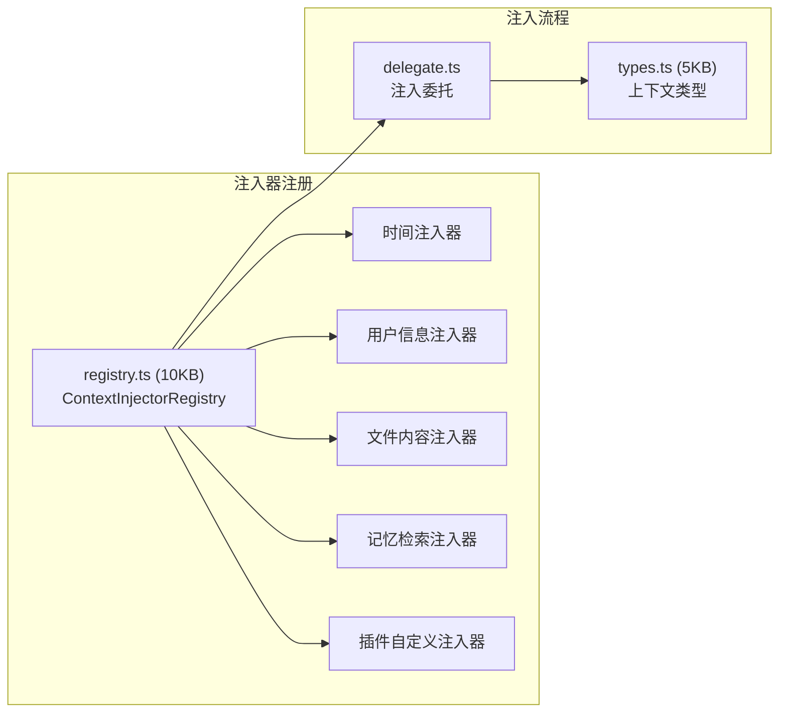

# 模块分析：记忆与上下文引擎 (Memory & Context)

## 记忆引擎 — `src/memory/` (102 文件)

为 Agent 提供持久化知识检索和长期记忆能力，是 RAG（检索增强生成）的核心基础设施。

### 混合检索策略

### 嵌入模型支持矩阵

| 供应商  | 文件                          | 特性                |
| ------- | ----------------------------- | ------------------- |
| OpenAI  | `embeddings-openai.ts`        | text-embedding-3-\* |
| Gemini  | `embeddings-gemini.ts` (10KB) | 批量 API 支持       |
| Voyage  | `embeddings-voyage.ts`        | 高质量代码嵌入      |
| Ollama  | `embeddings-ollama.ts`        | 本地运行            |
| Mistral | `embeddings-mistral.ts`       | 多语言支持          |
| Remote  | `embeddings-remote-*.ts`      | 自定义 HTTP 端点    |

### QMD 查询管理器

`qmd-manager.ts`（69KB）是记忆系统的高级查询编排器：

- 支持复杂的多条件查询
- 查询范围控制（全局/工作区/会话级）
- 智能分页与结果缓存
- 会话文件索引管理（`session-files.ts`）

### 自动同步机制

`manager-sync-ops.ts`（45KB）负责：

- 工作区 Markdown 文件变更监控
- 会话 Transcript 自动切片索引
- 文件内容增量更新
- 嵌入向量去重（`vector-dedupe`）

---

## 上下文引擎 — `src/context-engine/` (7 文件)

动态注入上下文到 Agent Prompt 的核心框架。

### 注册器模式

`registry.ts` 实现了注入器注册中心：

1. 系统启动时各模块注册自己的上下文注入器
2. Agent 构建 Prompt 前，按优先级调用所有注入器
3. 注入器返回结构化上下文片段
4. 框架将片段合并到 System Prompt 中

### 注入内容类型

| 注入器 | 内容                     | 来源        |
| ------ | ------------------------ | ----------- |
| 时间   | 当前日期、时区、时间格式 | 系统        |
| 用户   | 发送者身份、权限级别     | Channel     |
| 文件   | 当前工作区关键文件内容   | 文件系统    |
| 记忆   | RAG 检索到的相关历史     | Memory 引擎 |
| 插件   | 自定义业务上下文         | Plugin Hook |
