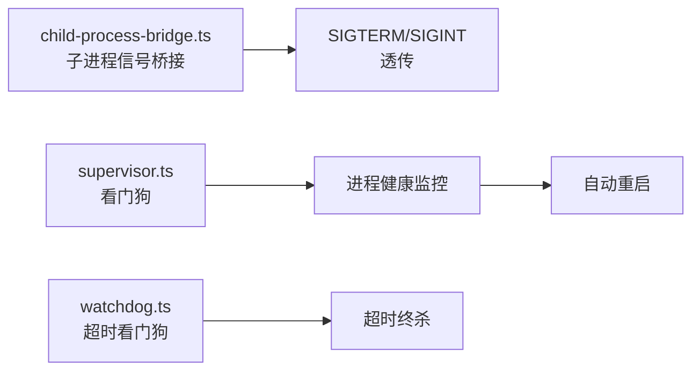

# 模块分析：进程与工具 (Process & Utilities)

## 进程管理 — `src/process/`

### 核心组件

| 文件                      | 功能                           |
| ------------------------- | ------------------------------ |
| `child-process-bridge.ts` | 父子进程信号桥接，防止僵尸进程 |
| `supervisor.ts`           | 进程监控与自动恢复             |
| `watchdog.ts`             | 执行超时保护                   |
| `shell.ts`                | 跨平台 Shell 执行              |

---

## 共享工具 — `src/utils/`, `src/shared/`

### 核心工具（`src/utils.ts` 10KB）

- 字符串处理、格式化
- 异步辅助函数
- 类型守卫

### 共享模块（`src/shared/`）

- 跨模块共享的类型定义
- 公共常量
- 工具函数

---

## Markdown 处理 — `src/markdown/`

Markdown 解析与渲染工具，供渠道回复和文档处理使用。

---

## 投票系统 — `src/polls.ts`, `src/poll-params.ts`

支持在渠道消息中创建投票：

- 投票参数解析
- 多渠道投票分发
- 结果统计
