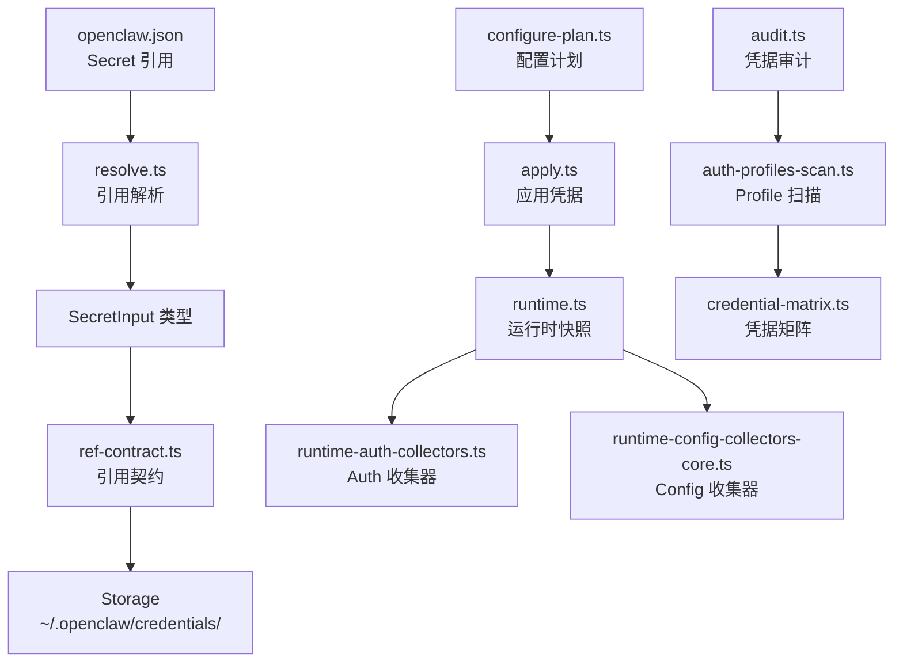

# 模块深度分析：密钥管理系统

> 基于 `src/secrets/`（53 个文件）源码分析，覆盖 Secret 引用、Auth Profile、运行时收集器。

## 1. 架构概览



## 2. Secret 引用类型

```typescript
type SecretInput =
  | string                              // 明文值
  | { $env: string }                    // 环境变量引用
  | { $secret: string }                 // Secret 存储引用
  | { $file: string }                   // 文件引用
  | { ref: string; target?: string }    // 命名引用
```

## 3. Auth Profile 系统

Auth Profile 将多个凭据分组，支持按 Agent/渠道/场景选择：

```json
{
  "secrets": {
    "profiles": {
      "production": {
        "OPENAI_API_KEY": { "$env": "PROD_OPENAI_KEY" },
        "ANTHROPIC_API_KEY": { "$secret": "prod-anthropic" }
      },
      "development": {
        "OPENAI_API_KEY": "sk-dev-xxx"
      }
    },
    "defaults": {
      "profile": "production"
    }
  }
}
```

## 4. 运行时收集器

6 组收集器按模块化组织：

| 收集器 | 文件 | 职责 |
|--------|------|------|
| Auth | `runtime-auth-collectors.ts` | AI Provider 凭据 |
| Core | `runtime-config-collectors-core.ts` | 核心配置凭据 |
| Channels | `runtime-config-collectors-channels.ts` | 渠道 Token |
| TTS | `runtime-config-collectors-tts.ts` | TTS API Key |
| Web Tools | `runtime-web-tools.ts` | Web 工具凭据 |
| Gateway Auth | `runtime-gateway-auth-surfaces.ts` | Gateway 认证面 |

## 5. 凭据矩阵

`credential-matrix.ts` 生成所有已配置凭据的矩阵视图，用于 `openclaw config` 命令显示。

## 6. 执行解析策略

`exec-resolution-policy.ts` — 控制 Secret 在运行时如何解析：
- **eager**：启动时立即解析
- **lazy**：使用时按需解析
- **cached**：解析后缓存

## 7. 关键文件

| 文件 | 行数 | 职责 |
|------|------|------|
| `runtime.ts` | ~600 | 运行时 Secret 快照 |
| `resolve.ts` | ~400 | Secret 引用解析 |
| `configure.ts` | ~300 | 交互式配置向导 |
| `configure-plan.ts` | ~250 | 配置变更计划 |
| `apply.ts` | ~200 | 凭据应用 |
| `audit.ts` | ~200 | 凭据健康审计 |
