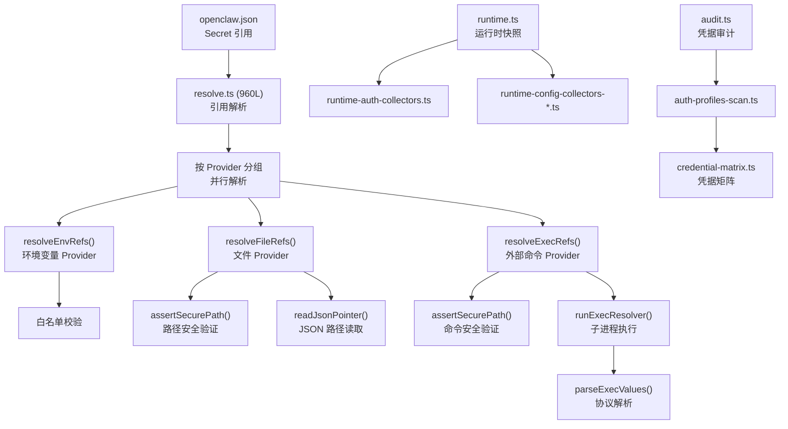
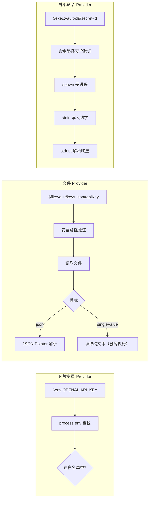
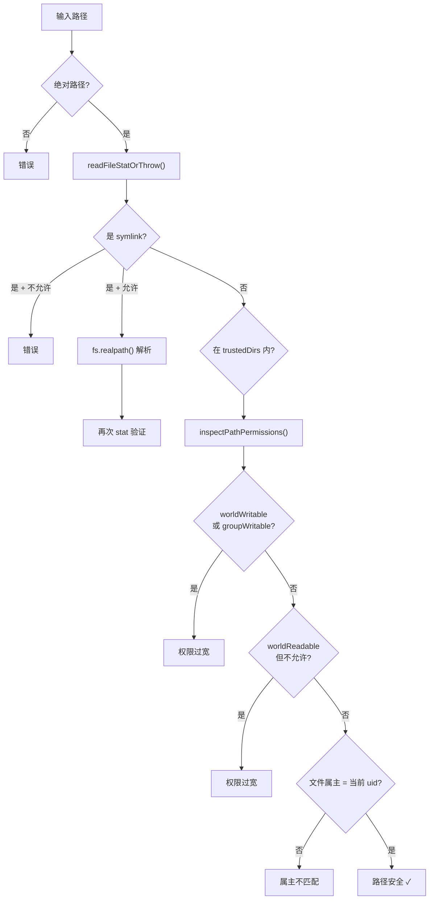

# 模块深度分析：密钥管理系统

> 基于 `src/secrets/`（53 个文件）源码逐行分析，覆盖 3 种 Secret Provider、引用解析、安全路径、运行时收集器。

## 1. 架构概览



## 2. 引用解析核心（`resolve.ts` — 960L）

### 2.1 三种 Secret Provider



### 2.2 环境变量 Provider

```typescript
async function resolveEnvRefs(params): Promise<ProviderResolutionOutput> {
  // 1. 白名单校验: providerConfig.allowlist 非空时强制匹配
  // 2. process.env[ref.id] 查找
  // 3. 缺失或空值 → SecretRefResolutionError
}
```

### 2.3 文件 Provider

两种模式：
- **json**（默认）：读取 JSON 文件 → `readJsonPointer(payload, ref.id)` 深层取值
- **singleValue**：读取整文件为一个字符串值（去除尾换行）

安全验证：
```typescript
await assertSecurePath({
  targetPath,
  label: "secrets.providers.xxx.path",
  // 验证: 绝对路径、非 symlink、权限收紧、属主匹配
});
```

### 2.4 外部命令 Provider（Exec Protocol v1）

```typescript
// 请求（写入 stdin）
{ protocolVersion: 1, provider: "vault", ids: ["key1", "key2"] }

// 响应（从 stdout 读取）
{
  protocolVersion: 1,
  values: { key1: "secret-value-1", key2: "secret-value-2" },
  errors: { key3: { message: "not found" } }  // 可选
}
```

安全约束：
- 命令路径必须绝对路径
- 可配置 `trustedDirs`（限制可执行命令目录）
- 可配置 `allowInsecurePath`（跳过权限检查）
- 环境变量白名单 `passEnv`（仅传递指定变量）
- 超时保护：`timeoutMs`（默认 5s）+ `noOutputTimeoutMs`
- 输出限制：`maxOutputBytes`（默认 1MB）

---

## 3. 安全路径验证（`assertSecurePath()`）



---

## 4. 运行时收集器

6 组收集器，按关注域分离：

| 收集器 | 文件 | 职责 |
|--------|------|------|
| Auth | `runtime-auth-collectors.ts` | AI Provider 凭据（OpenAI/Anthropic/...） |
| Core | `runtime-config-collectors-core.ts` | 核心配置凭据 |
| Channels | `runtime-config-collectors-channels.ts` | 渠道 Bot Token |
| TTS | `runtime-config-collectors-tts.ts` | TTS API Key |
| Web Tools | `runtime-web-tools.ts` | Web 工具凭据 |
| Gateway Auth | `runtime-gateway-auth-surfaces.ts` | Gateway 认证面 |

## 5. Auth Profile 系统

```json
{
  "secrets": {
    "profiles": {
      "production": {
        "OPENAI_API_KEY": { "$env": "PROD_OPENAI_KEY" },
        "ANTHROPIC_API_KEY": { "$secret": "prod-anthropic" }
      }
    }
  }
}
```

## 6. 凭据矩阵

`credential-matrix.ts` — 生成所有已配置凭据的表格视图（用于 `openclaw config` 命令）。

## 7. 错误体系

两级错误类型：
```typescript
class SecretProviderResolutionError extends Error {
  scope = "provider";  // Provider 级别错误（配置缺失、超时）
}

class SecretRefResolutionError extends Error {
  scope = "ref";       // 引用级别错误（缺失、白名单外）
}
```

## 8. 解析限制

```typescript
const DEFAULTS = {
  maxProviderConcurrency: 4,    // 并行 Provider 数
  maxRefsPerProvider: 512,      // 每 Provider 最大引用数
  maxBatchBytes: 256 KB,        // 批次请求最大字节
  fileMaxBytes: 1 MB,           // 文件 Provider 最大文件
  execTimeoutMs: 5_000,         // Exec 超时
  execMaxOutputBytes: 1 MB,     // Exec 输出限制
};
```

## 9. 关键文件清单

| 文件 | 行数 | 职责 |
|------|------|------|
| `resolve.ts` | 960 | 三种 Provider 解析核心 |
| `runtime.ts` | ~600 | 运行时 Secret 快照 |
| `configure.ts` | ~300 | 交互式配置向导 |
| `configure-plan.ts` | ~250 | 配置变更计划 |
| `apply.ts` | ~200 | 凭据应用 |
| `audit.ts` | ~200 | 凭据健康审计 |
| `ref-contract.ts` | ~150 | Secret 引用契约 |
| `json-pointer.ts` | ~80 | JSON Pointer 实现 |
| `credential-matrix.ts` | ~200 | 凭据矩阵生成 |
| `auth-profiles-scan.ts` | ~150 | Profile 扫描 |
