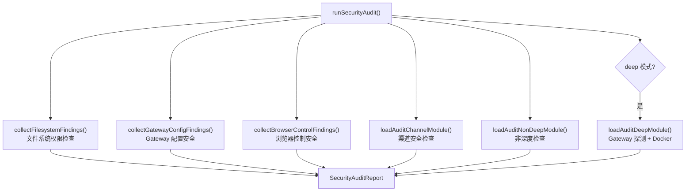

# 模块深度分析：安全审计模型

> 基于 `src/security/audit.ts`（1319 行 / 50KB）及 35 个安全模块文件的源码分析。

## 1. 安全审计引擎

`audit.ts` 实现了全面的安全审计框架，检测 30+ 种安全风险：



### 1.1 审计报告结构

```typescript
type SecurityAuditReport = {
  ts: number;
  summary: { critical: number; warn: number; info: number };
  findings: SecurityAuditFinding[];
  deep?: {
    gateway?: { attempted: boolean; url: string | null; ok: boolean; error: string | null };
  };
};

type SecurityAuditFinding = {
  checkId: string;           // 如 "gateway.bind_no_auth"
  severity: "info" | "warn" | "critical";
  title: string;
  detail: string;
  remediation?: string;      // 修复建议
};
```

---

## 2. 安全检查清单

### 2.1 文件系统权限（`collectFilesystemFindings`）

| checkId | 严重级 | 检测内容 |
|---------|--------|---------|
| `fs.state_dir.symlink` | warn | ~/.openclaw 是符号链接 |
| `fs.state_dir.perms_world_writable` | **critical** | 状态目录所有人可写 |
| `fs.state_dir.perms_group_writable` | warn | 状态目录组可写 |
| `fs.config.perms_writable` | **critical** | 配置文件他人可写 |
| `fs.config.perms_world_readable` | **critical** | 配置文件所有人可读（含 Token） |

### 2.2 Gateway 配置安全（`collectGatewayConfigFindings`）

| checkId | 严重级 | 检测内容 |
|---------|--------|---------|
| `gateway.bind_no_auth` | **critical** | 非回环绑定无认证 |
| `gateway.loopback_no_auth` | **critical** | 回环绑定 + Control UI 无密钥 |
| `gateway.trusted_proxy_auth` | **critical** | 受信代理模式启用 |
| `gateway.trusted_proxy_no_proxies` | **critical** | 受信代理模式但列表为空 |
| `gateway.trusted_proxy_no_user_header` | **critical** | 受信代理缺少 userHeader |
| `gateway.control_ui.device_auth_disabled` | **critical** | 设备认证被禁用 |
| `gateway.control_ui.allowed_origins_wildcard` | critical/warn | Origin 白名单含通配符 |
| `gateway.control_ui.host_header_origin_fallback` | critical/warn | Host 头回退启用 |
| `gateway.tailscale_funnel` | **critical** | Tailscale Funnel 公网暴露 |
| `gateway.tailscale_serve` | info | Tailscale Serve tailnet 暴露 |
| `gateway.token_too_short` | warn | Token < 24 字符 |
| `gateway.auth_no_rate_limit` | warn | 无认证限速 |
| `gateway.tools_invoke_http.dangerous_allow` | critical/warn | HTTP 工具调用重新启用危险工具 |
| `gateway.real_ip_fallback_enabled` | critical/warn | X-Real-IP 回退启用 |
| `discovery.mdns_full_mode` | critical/warn | mDNS full 模式泄露元数据 |

### 2.3 浏览器控制安全

| checkId | 严重级 | 检测内容 |
|---------|--------|---------|
| `browser.control_no_auth` | **critical** | 浏览器控制无认证 |
| `browser.cdp_url_remote` | warn | CDP URL 指向远程主机 |
| `browser.cdp_url_plaintext` | warn | 纯文本 CDP 连接 |

---

## 3. 安全子模块体系

### 3.1 模块懒加载架构

```typescript
// 5 组运行时模块按需加载
let auditNonDeepModulePromise: Promise<...> | undefined;   // 非深度检查
let auditDeepModulePromise: Promise<...> | undefined;       // 深度检查（Gateway 探测）
let auditChannelModulePromise: Promise<...> | undefined;    // 渠道安全
let channelPluginsModulePromise: Promise<...> | undefined;  // 渠道插件
let gatewayProbeDepsPromise: Promise<...> | undefined;      // Gateway 探测依赖
```

### 3.2 文件清单（35 个安全文件）

| 文件 | 职责 |
|------|------|
| `audit.ts` | 主审计引擎 |
| `audit.nondeep.runtime.ts` | 非深度审计（配置分析） |
| `audit.deep.runtime.ts` | 深度审计（网络探测） |
| `audit-channel.ts` / `*.runtime.ts` | 渠道安全审计 |
| `audit-extra.sync.ts` / `async.ts` | 额外同步/异步审计 |
| `audit-fs.ts` | 文件系统权限检查 |
| `audit-tool-policy.ts` | 工具策略审计 |
| `config-regex.ts` | 配置正则安全 |
| `safe-regex.ts` | 正则表达式 ReDoS 防护 |
| `dangerous-config-flags.ts` | 危险配置标志检测 |
| `dangerous-tools.ts` | 危险工具默认拒绝列表 |
| `dm-policy-shared.ts` | DM 策略共享逻辑 |
| `external-content.ts` | 外部内容安全 |
| `fix.ts` | 安全修复建议 |
| `mutable-allowlist-detectors.ts` | 可变白名单检测 |
| `scan-paths.ts` | 路径扫描 |
| `secret-equal.ts` | 时间安全的密钥比较 |
| `skill-scanner.ts` | 技能文件安全扫描 |
| `channel-metadata.ts` | 渠道元数据安全 |
| `windows-acl.ts` | Windows ACL 检查（icacls） |

---

## 4. DM 安全策略

`dm-policy-shared.ts` 实现消息权限控制：

- **pairing**：需要配对后才能交互
- **open**：开放式 DM，需要 `allowFrom` 包含 `"*"`
- **closed**：拒绝所有未配对的 DM

---

## 5. 正则安全

`safe-regex.ts` 防护 ReDoS（正则表达式拒绝服务）攻击：
- 检测可能导致指数级回溯的正则模式
- 对用户提供的正则表达式进行安全评估
