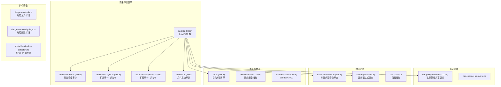
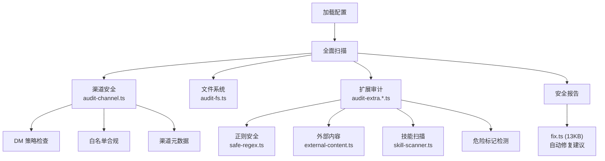

# 模块分析：安全模型 (Security Model)

## 概览 — `src/security/` (35 文件)

安全模块实现了 OpenClaw 的纵深防御体系，涵盖配置审计、命令执行审批、DM 策略、正则安全和外部内容防护。

### 安全审计引擎

`audit.ts`（50KB，测试文件 116KB）是安全体系的核心：

### DM 策略

`dm-policy-shared.ts`（11KB）控制私聊行为：

- 哪些渠道允许私聊
- 私聊消息的权限级别
- 群组消息 vs 私聊的差异化处理
- 跨渠道策略一致性

### 正则表达式安全

`safe-regex.ts`（9KB）防止 ReDoS（正则表达式拒绝服务）攻击：

- 检测潜在的回溯爆炸模式
- 配置中用户提供的正则进行安全性验证
- 提供安全的替代方案

### 外部内容安全

`external-content.ts`（11KB）审查来自外部的内容：

- URL 安全性检查
- 注入攻击检测
- 内容长度限制
- 敏感信息泄漏预防

### 技能安全扫描

`skill-scanner.ts`（15KB）对工作区技能进行安全分析：

- 权限范围检查
- 文件系统访问审计
- 网络请求审计
- 危险操作检测

### Windows ACL 管理

`windows-acl.ts`（10KB）处理 Windows 平台特有的访问控制：

- 文件/目录权限设置
- 服务账户权限管理
- 配置文件保护

---

## 执行审批系统 — `src/infra/exec-approvals*`

与安全模块配合的命令执行审批体系（详见 [基础设施文档](./infra-core.md)）：

- 命令分类（安全/需审批/禁止）
- Safe-bin 策略配置
- 白名单模式匹配
- 审批流转与记录
