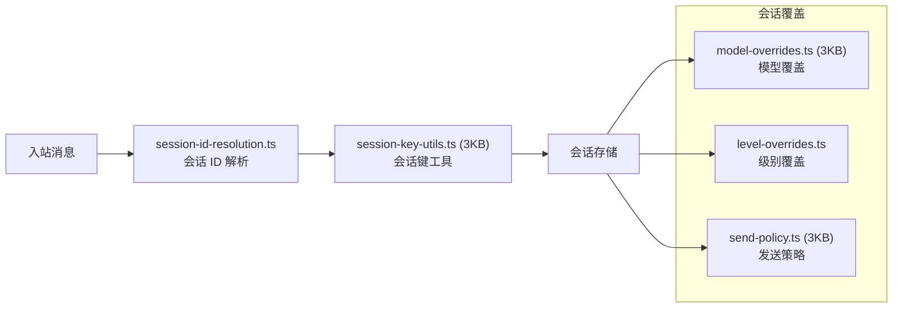

# 模块分析：会话与凭据 (Sessions & Secrets)

## 会话管理 — `src/sessions/` (13 文件)

### 核心功能

| 文件                       | 功能                                   |
| -------------------------- | -------------------------------------- |
| `session-id-resolution.ts` | 多层会话 ID 解析（渠道 → 路由 → 内部） |
| `session-key-utils.ts`     | 会话键计算与缓存                       |
| `model-overrides.ts`       | 系统级模型参数重写（温度、Top-P 等）   |
| `send-policy.ts`           | 消息发送策略（限速、去重）             |
| `input-provenance.ts`      | 输入来源追踪                           |
| `transcript-events.ts`     | 会话记录事件                           |

---

## 凭据管理 — `src/secrets/`

安全存储和管理 API 密钥、Token 等敏感信息：

- 加密存储
- 环境变量引用（`${SECRET_REF}`）
- 运行时安全注入
- 审计日志

---

## Gateway 会话工具

`src/gateway/session-utils.ts`（32KB）是会话管理的重量级实现：

- 会话 CRUD
- 历史记录管理
- 会话状态持久化
- 会话重置与清理（`session-reset-service.ts`）
- 配置实时修改（`sessions-patch.ts` 15KB）
