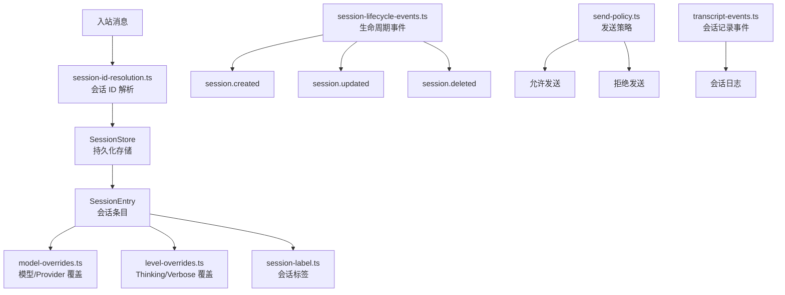

# 模块深度分析：会话管理系统

> 基于 `src/sessions/`（15 个文件）源码分析，覆盖会话 ID 解析、生命周期事件、模型覆盖。

## 1. 架构概览



## 2. 会话 ID 解析

```typescript
// session-id.ts
type SessionId = string;  // 唯一标识符

// session-key-utils.ts
type ParsedAgentSessionKey = {
  agentId: string;     // Agent 标识
  rest: string;        // 剩余部分（mainKey/peerId等）
};

// 解析: "agent:main:telegram:direct:user123"
// → { agentId: "main", rest: "telegram:direct:user123" }
```

## 3. 模型覆盖

```typescript
// model-overrides.ts — 会话级模型覆盖
type ModelOverride = {
  provider?: string;     // Provider 覆盖
  model?: string;        // 模型覆盖
  source?: string;       // 覆盖来源（"user" | "fallback"）
};
```

## 4. 发送策略

```typescript
// send-policy.ts
export function resolveSendPolicy(params): SendPolicyResult {
  // 检查:
  // 1. DM 策略（pairing 状态）
  // 2. 渠道白名单
  // 3. 会话限制
  // 4. 速率限制
  return { action: "allow" | "deny", reason?: string };
}
```

## 5. 输入来源追踪

```typescript
// input-provenance.ts
type InputProvenance = {
  channel: string;      // 来源渠道
  accountId?: string;   // 账号 ID
  peerId?: string;      // 对端 ID
  chatType: ChatType;   // direct | group | channel
  timestamp: number;    // 时间戳
};
```

## 6. 关键文件

| 文件 | 职责 |
|------|------|
| `session-id.ts` | SessionId 类型和操作 |
| `session-id-resolution.ts` | 会话 ID 解析逻辑 |
| `session-key-utils.ts` | Session Key 解析工具 |
| `model-overrides.ts` | 模型/Provider 覆盖 |
| `level-overrides.ts` | Thinking/Verbose 覆盖 |
| `send-policy.ts` | 发送策略引擎 |
| `session-label.ts` | 会话标签 |
| `session-lifecycle-events.ts` | 生命周期事件 |
| `transcript-events.ts` | 会话记录事件 |
| `input-provenance.ts` | 输入来源追踪 |
