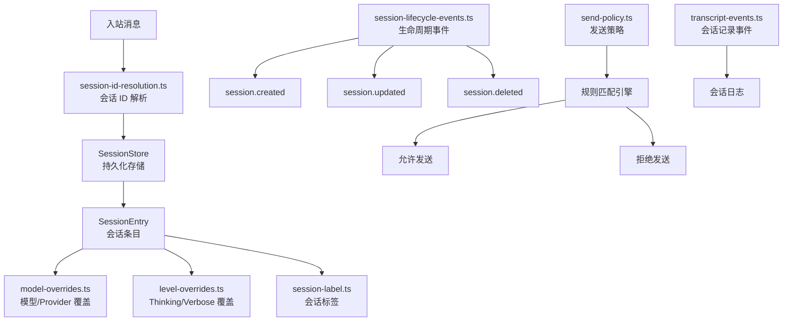
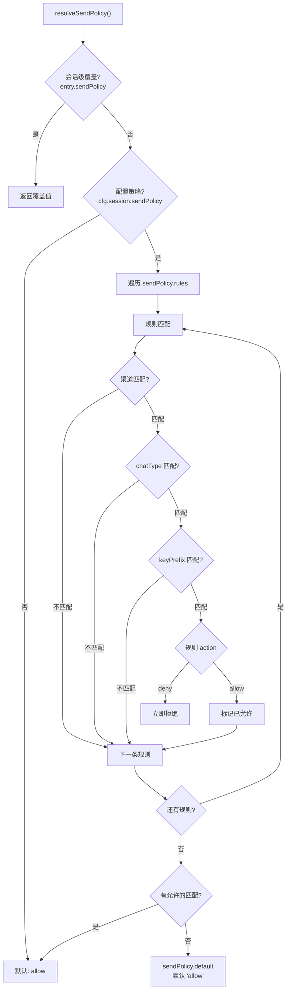

# 模块深度分析：会话管理系统

> 基于 `src/sessions/`（15 个文件）源码逐行分析，覆盖会话 ID 解析、发送策略引擎、生命周期事件。

## 1. 架构概览



## 2. 发送策略引擎（`send-policy.ts` — 124L）

### 2.1 策略决策流程



### 2.2 规则匹配字段

```typescript
// 4 个匹配维度
type SendPolicyRule = {
  action: "allow" | "deny";
  match: {
    channel?: string;      // 渠道匹配（telegram/whatsapp）
    chatType?: SessionChatType; // 聊天类型（direct/group/channel）
    keyPrefix?: string;    // Session Key 前缀（stripped）
    rawKeyPrefix?: string; // 原始 Key 前缀
  };
};
```

### 2.3 渠道解析回退链

```typescript
// 5 级渠道解析
const channel =
  normalizeMatchValue(params.channel) ??       // 1. 显式参数
  normalizeMatchValue(entry?.channel) ??       // 2. 会话条目
  normalizeMatchValue(entry?.lastChannel) ??   // 3. 最后使用的渠道
  deriveChannelFromKey(params.sessionKey);      // 4. 从 SessionKey 推导
```

### 2.4 Session Key 前缀剥离

```typescript
// "agent:main:telegram:direct:user123"
// → stripAgentSessionKeyPrefix → "telegram:direct:user123"
// → 用于 keyPrefix 匹配
```

---

## 3. 会话 ID 解析

### 3.1 Session ID 类型

```typescript
// session-id.ts
type SessionId = string;  // 唯一标识符

// session-id-resolution.ts
// 从多种来源推导 SessionId:
// 1. 显式 sessionId 参数
// 2. SessionKey + AgentId 组合查找
// 3. Provider 特有的 session mapping
```

### 3.2 Session Key 工具

```typescript
// session-key-utils.ts
function parseAgentSessionKey(raw: string): ParsedAgentSessionKey | null;
// "agent:main:telegram:direct:user123"
// → { agentId: "main", rest: "telegram:direct:user123" }

function deriveSessionChatType(key?: string): SessionChatType;
// "agent:main:telegram:group:chat123" → "group"
// "agent:main:telegram:direct:user123" → "direct"
// "agent:main:main" → "unknown"
```

---

## 4. 模型覆盖（`model-overrides.ts`）

```typescript
// 会话级模型覆盖
type ModelOverride = {
  provider?: string;       // Provider 覆盖（如 "openai"）
  model?: string;          // 模型覆盖（如 "gpt-4o"）
  source?: string;         // 覆盖来源
};

// 应用优先级:
// 1. 会话 entry.providerOverride / entry.modelOverride
// 2. Agent 配置 agents[id].model
// 3. 全局默认 agents.defaults.model
```

## 5. Thinking/Verbose 覆盖（`level-overrides.ts`）

```typescript
// 7 个 Thinking 级别:
type ThinkLevel = "off" | "minimal" | "low" | "medium" | "high" | "xhigh" | "adaptive";

// 4 个 Verbose 级别（控制工具调用输出详细程度）
```

## 6. 会话生命周期事件（`session-lifecycle-events.ts`）

```typescript
// 会话创建/更新/删除时发出事件
emitSessionLifecycleEvent("session.created", { sessionKey, agentId, ... });
emitSessionLifecycleEvent("session.updated", { sessionKey, changes, ... });
emitSessionLifecycleEvent("session.deleted", { sessionKey, reason, ... });
```

## 7. 会话记录事件（`transcript-events.ts`）

记录 Agent 对话的完整交互日志，支持：
- 用户消息记录
- Agent 回复记录
- 工具调用记录
- Token 使用量记录

## 8. 输入来源追踪（`input-provenance.ts`）

```typescript
type InputProvenance = {
  channel: string;        // 来源渠道
  accountId?: string;     // 账号 ID
  peerId?: string;        // 对端 ID
  chatType: ChatType;     // direct | group | channel
  timestamp: number;      // 时间戳
};
```

## 9. 关键文件清单

| 文件 | 行数 | 职责 |
|------|------|------|
| `send-policy.ts` | 124 | 发送策略规则引擎 |
| `session-id.ts` | ~50 | SessionId 类型 |
| `session-id-resolution.ts` | ~150 | Session ID 解析 |
| `session-key-utils.ts` | ~100 | Session Key 解析工具 |
| `model-overrides.ts` | ~80 | 模型覆盖 |
| `level-overrides.ts` | ~60 | Thinking/Verbose 覆盖 |
| `session-label.ts` | ~40 | 会话标签 |
| `session-lifecycle-events.ts` | ~100 | 生命周期事件 |
| `transcript-events.ts` | ~80 | 会话记录事件 |
| `input-provenance.ts` | ~50 | 输入来源追踪 |
