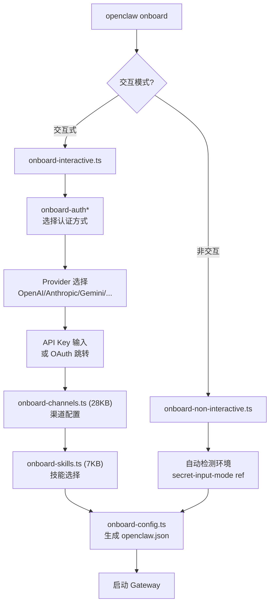

# 模块分析：配置向导 (Setup & Wizard)

## 入门向导 — `src/commands/onboard*` (25+ 文件)

### 核心组件

| 文件                  | 大小 | 功能              |
| --------------------- | ---- | ----------------- |
| `onboard-channels.ts` | 28KB | 渠道配置引导      |
| `onboard-helpers.ts`  | 15KB | 向导辅助工具      |
| `onboard-custom.ts`   | 24KB | 自定义配置        |
| `onboard-search.ts`   | 9KB  | 搜索可用 Provider |
| `onboard-remote.ts`   | 8KB  | 远程配置          |
| `onboard-skills.ts`   | 7KB  | 技能选择          |

---

## 交互式配置 — `src/commands/configure*`

| 文件                              | 功能               |
| --------------------------------- | ------------------ |
| `configure.wizard.ts` (21KB)      | 完整交互式配置向导 |
| `configure.gateway.ts` (10KB)     | Gateway 配置       |
| `configure.gateway-auth.ts` (5KB) | 认证配置           |
| `configure.daemon.ts` (5KB)       | Daemon 配置        |
| `configure.channels.ts`           | 渠道配置           |

---

## Setup 初始化 — `src/wizard/`

低层初始化逻辑，处理首次运行时的环境检测和基础配置生成。
