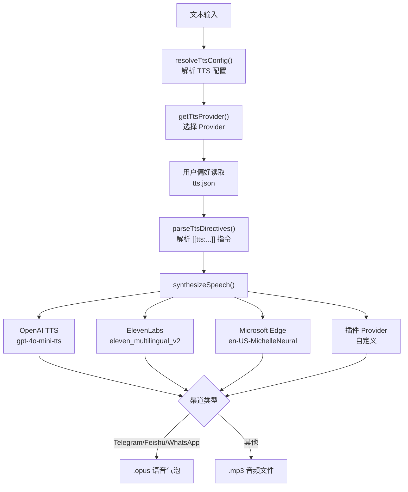

# 模块深度分析：语音合成系统（TTS）

> 基于 `src/tts/tts.ts`（980 行）源码分析，覆盖 3 Provider、指令解析、渠道适配。

## 1. 架构概览



## 2. Provider 配置

### OpenAI TTS

```typescript
{
  model: "gpt-4o-mini-tts",   // 默认模型
  voice: "alloy",              // 默认语音
  baseUrl: "https://api.openai.com/v1",
  speed: undefined,            // 播放速度 (0.25-4.0)
  instructions: undefined,     // 表达力指导
}
```

### ElevenLabs

```typescript
{
  voiceId: "pMsXgVXv3BLzUgSXRplE",  // 默认语音 ID
  modelId: "eleven_multilingual_v2",
  voiceSettings: {
    stability: 0.5,
    similarityBoost: 0.75,
    style: 0.0,
    useSpeakerBoost: true,
    speed: 1.0,
  },
  seed: undefined,                    // 可复现种子
  applyTextNormalization: undefined,  // "auto" | "on" | "off"
  languageCode: undefined,            // 语言代码
}
```

### Microsoft Edge TTS

```typescript
{
  voice: "en-US-MichelleNeural",
  lang: "en-US",
  outputFormat: "audio-24khz-48kbitrate-mono-mp3",
  saveSubtitles: false,
  proxy: undefined,
}
```

## 3. Auto Mode

4 种自动模式（`TtsAutoMode`）：

| 模式 | 行为 |
|------|------|
| `off` | TTS 关闭 |
| `always` | 所有回复生成语音 |
| `inbound` | 仅用户发送语音/音频时 |
| `tagged` | 仅 Agent 输出含 `[[tts]]` 标签时 |

优先级链：`session覆盖 > 用户偏好(tts.json) > 配置文件`

## 4. Provider 回退

```typescript
// 按顺序尝试直到成功
const providers = resolveTtsProviderOrder(primary, cfg);
// ["openai", "elevenlabs", "microsoft"]
for (const provider of providers) {
  try { return await provider.synthesize(text); }
  catch { errors.push(err.message); }
}
```

## 5. Voice Bubble 适配

```typescript
const VOICE_BUBBLE_CHANNELS = new Set(["telegram", "feishu", "whatsapp"]);
// 这些渠道 → opus 格式 → 显示为语音气泡
// 其他渠道 → mp3 格式 → 显示为音频文件
```

## 6. Model Override 策略

```typescript
type ResolvedTtsModelOverrides = {
  enabled: boolean;
  allowText: boolean;         // 允许 Agent 覆盖文本
  allowProvider: boolean;     // 允许切换 Provider（默认 false，高风险）
  allowVoice: boolean;        // 允许切换语音
  allowModelId: boolean;      // 允许切换模型
  allowVoiceSettings: boolean; // 允许调整语音参数
  allowSeed: boolean;         // 允许设置种子
};
```

## 7. Telephony 支持

`textToSpeechTelephony()` — 专用电话语音合成，Provider 必须实现 `synthesizeTelephony` 方法。
